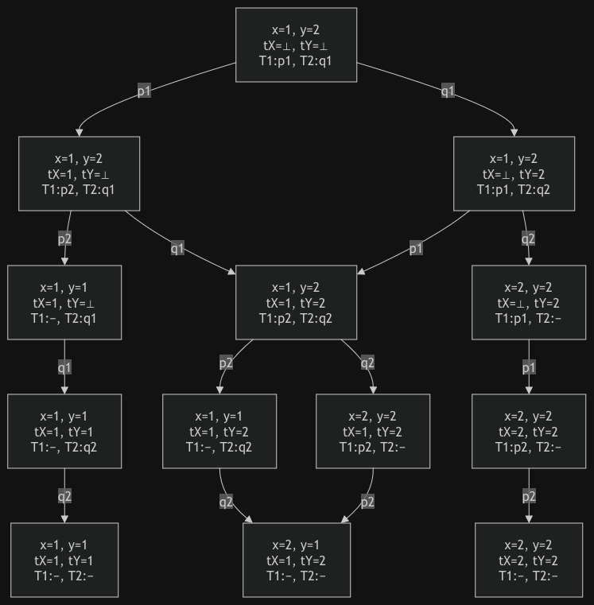
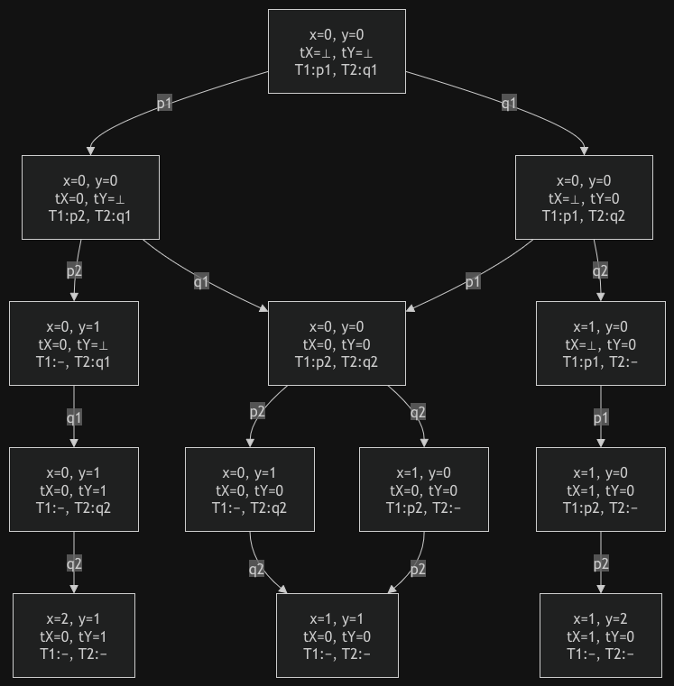
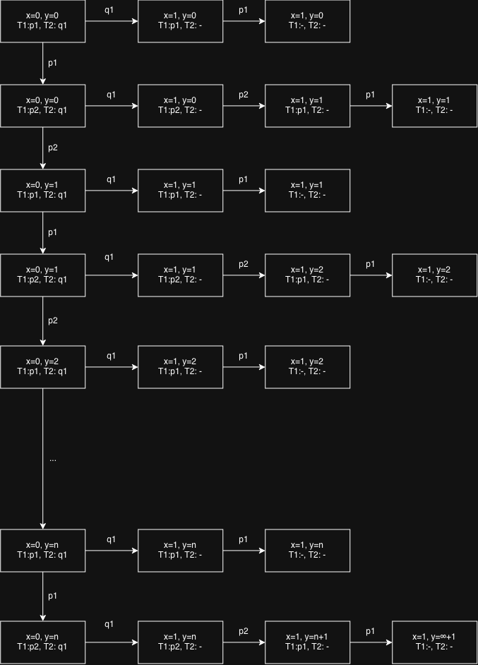

# Ejercicio 1
## Punto A

Viendo primero la semántica de los hilos por separado: 

- Si ignoramos la declaración e inicialización de las variables globales:

    - $\llbracket T_1 \rrbracket = \lambda\sigma.\sigma[y \mapsto \sigma(x)]$

    - $\llbracket T_2 \rrbracket = \lambda\sigma.\sigma[x \mapsto \sigma(y)]$

- Si aplicamos cada hilo por separado al estado inicial
$\sigma_0=[x\mapsto1,y\mapsto2]$:

    - $\llbracket T_1 \rrbracket\sigma_0 = \sigma_0[y\mapsto1] = [x\mapsto1,y\mapsto1]$

    - $\llbracket T_2 \rrbracket\sigma_0 = \sigma_0[x\mapsto2] = [x\mapsto2,y\mapsto2]$

Ahora, viendo la ejecución paralela de ambos hilos:

- $\llbracket T_1\parallel T_2\rrbracket=\lambda\sigma.\sigma[y\mapsto\sigma(x)]\oplus\lambda\sigma.\sigma[x\mapsto\sigma(y)]\oplus\lambda\sigma.\sigma[x\mapsto\sigma(y),y\mapsto\sigma(x)]$

Para el diagrama, cada thread va a tener dos instrucciones, en la primera lee la variable que va a asignarle a la otra y luego la escribe. Para eso estan `tX`, que representa la variable en la que T1 guarda el valor de `x`, y `tY`, que representa la variable en la que T2 guarda el valor de `y`. 



## Punto B 

Viendo primero la semántica de los hilos por separado: 
- $\llbracket T_1 \rrbracket = \lambda\sigma.\sigma[y \mapsto \sigma(x) + 1]$
- $\llbracket T_2 \rrbracket = \lambda\sigma.\sigma[x \mapsto \sigma(y) + 1]$

Para el caso de la ejecución paralela: 
- $\llbracket T_1\parallel T_2\rrbracket=\lambda\sigma.\sigma[x \mapsto \sigma(y) + 1, y \mapsto \sigma(x) + 1] \oplus \lambda\sigma.\sigma[x \mapsto \sigma(y) + 1, y \mapsto \sigma(y) + 2] \oplus \lambda\sigma.\sigma[x \mapsto \sigma(x) + 2, y \mapsto \sigma(x) + 1]$



## Punto C 

Semántica por separado: 
- $\llbracket T_1\rrbracket=\lambda\sigma.\operatorname{if}\ \llbracket x<1\rrbracket\sigma\ \operatorname{then}\bot\ \operatorname{else}\sigma$
- $\llbracket T_2 \rrbracket = \lambda\sigma.\sigma[x \mapsto 1]$

Ejecución Paralela: 
- $\llbracket T_1\parallel T_2\rrbracket=\displaystyle\bigoplus_{n\in\mathbb{N}_0}\lambda\sigma.\sigma[x\mapsto1,y\mapsto\sigma(y)+n]\oplus\bot$

Para el diagrama de transición de estados asumo que todas las operaciones son atomicas para disminuir la complejidad del grafico, y tambien asumo que es weakly fair. 



Deberían haber infinitos estados, pero la idea es la del grafico. 

# Ejercicio 2

Separo los programas en sus operaciones atómicas:

```yaml
global n = 0

thread T1
    local tmp
    p1: do K times
        p2: tmp = n
        p3: n = tmp + 1

thread T2
    local tmp
    q1: do K times
        q2: tmp = n
        q3: n = tmp + 1
```

## Punto A

Para que el valor final de `n` sea `2K`, se puede ejecutar primero un hilo durante sus `K` iteraciones y luego el otro. También pueden alternarse, siempre que cada incremento se complete antes de que el otro hilo lea `n`.

| T1             | T2             | Estado                       |
|----------------|----------------|------------------------------|
| `do K times`   |                | `p:p2`                       |
| `tmp = n`      |                | `p.tmp = 0; p:p3`            |
| `n = tmp + 1`  |                | `n = 1; p:p1`                |
| ...            |                | ...                          |
| `do K times`   |                | `p:p2`                       |
| `tmp = n`      |                | `p.tmp = K-1; p:p3`          |
| `n = tmp + 1`  |                | `n = K; p:p1`                |
| `do K times`   |                | `p:−`                        |
|                | `do K times`   | `q:q2`                       |
|                | `tmp = n`      | `q.tmp = K; q:q3`            |
|                | `n = tmp + 1`  | `n = K+1; q:q1`              |
|                | ...            | ...                          |
|                | `do K times`   | `q:q2`                       |
|                | `tmp = n`      | `q.tmp = 2K-1; q:q3`         |
|                | `n = tmp + 1`  | `n = 2K; q:q1`               |
|                | `do K times`   | `q:−`                        |

## Punto B
Para que el valor final sea `k`, lo que tendría que pasar es que se vayan ejecutando sincronizadamente T1 y T2 dentro del ciclo, donde siempre leen ambos el valor de tmp antes de actualizar la variable, y escribe uno y despues el otro. 

| T1            | T2            | Estado              |
|---------------|---------------|---------------------|
| `do K times`  |               | `p:p2`              |
|               | `do K times`  | `q:q2`              |
| `tmp = n`     |               | `p.tmp = 0; p:p3`   |
|               | `tmp = n`     | `q.tmp = 0; q:q3`   |
| `n = tmp + 1` |               | `n = 1; p:p1`       |
|               | `n = tmp + 1` | `n = 1; q:q1`       |
| ...           | ...           | ...                 |
| `do K times`  |               | `p:p2`              |
|               | `do K times`  | `q:q2`              |
| `tmp = n`     |               | `p.tmp = k-1; p:p3` |
|               | `tmp = n`     | `q.tmp = k-1; q:q3` |
| `n = tmp + 1` |               | `n = k; p:p1`       |
|               | `n = tmp + 1` | `n = k; q:q1`       |
| `do K times`  |               | `p:-`               |
|               | `do K times`  | `q:-`               |

## Punto C 
Si, puede ocurrir para el siguiente entramado con `K=3`

| T1            | T2            | Estado            |
|---------------|---------------|-------------------|
| `do K times`  |               | `p:p2`            |
| `tmp = n`     |               | `p.tmp = 0; p:p3` |
|               | `do K times`  | `q:q2`            |
|               | `tmp = n`     | `q.tmp = 0; q:q3` |
|               | `n = tmp + 1` | `n=1; q:q1`       |
|               | `do K times`  | `q:q2`            |
|               | `tmp = n`     | `q.tmp = 1; q:q3` |
|               | `n = tmp + 1` | `n=2; q:q1`       |
| `n = tmp + 1` |               | `n = 1; p:p1`     |
|               | `do K times`  | `q:q2`            |
|               | `tmp = n`     | `q.tmp = 1; q:q3` |
| `do K times`  |               | `p:p2`            |
| `tmp = n`     |               | `p.tmp = 1; p:p3` |
| `n = tmp + 1` |               | `n = 2; p:p1`     |
| `do K times`  |               | `p:p2`            |
| `tmp = n`     |               | `p.tmp = 2; p:p3` |
| `n = tmp + 1` |               | `n = 3; p:p1`     |
| `do K times`  |               | `p:-`             |
|               | `n = tmp + 1` | `n=2; q:q1`       |
|               | `do K times`  | `q:-`             |

# Ejercicio 3 
Siendo que el programa es: 

```yaml
global x = 1
global y = 2
global z = 3

thread T1
    local tX
    p1: tX = x
    p2: y = tX

thread T2
    local tY
    q1: tY = y
    q2: z = tY

thread T3
    local tZ
    r1: tZ = z
    r2: x = tZ
```

Los resultados posibles pueden ser: 
| x | y | z |
|---|---|---|
| 1 | 1 | 1 |
| 2 | 2 | 2 |
| 3 | 3 | 3 |
| 3 | 1 | 2 |
| 3 | 1 | 1 |
| 2 | 1 | 2 |
| 3 | 3 | 2 |

Donde los primeros 3 surguen de ejecuciones secuenciales en algun orden de cada thread. 
El cuarto es en el cual los 3 threads leen antes de que el primer escriba. 
Y los ultimos 3 donde primero se escribe una variable y luego las otras dos leen antes de que la primera escriba y luego escriben las dos. 

# Ejercicio 4 
## Punto A
Si tenemos `N` threads y `K` instrucciones, cada ejecucion del programa tiene que ejecutar exactamente `N * K` lineas para terminar la ejecucion del programa. 

Como todas las ejecuciones posibles toman exactamente `N * K` pasos y hay que sumarle uno en el diagrama de estados por el estado inicial, entonces la cota minima de estados en el diagrama es de `N * K + 1`.

Esta cota es exacta si solo existe un posible orden de ejecucion de los distintos threads. En cambio si los threads son independientes entre si en ese caso hay una mayor cantidad de estados porque en cada nodo podemos llegar a tener `N` posibles aristas a nodos distintos. 

Una cota superior va a ser (K + 1)^N. Cada estado del diagrama queda 
determinado por el vector de program counters de los N threads, donde cada 
pc_i puede tomar independientemente uno de K + 1 valores posibles (de 0 a K, 
sin terminar y terminado inclusive). Como los threads son independientes, 
todas las combinaciones de estos N valores son alcanzables, dando 
(K + 1)^N estados posibles en total.


## Punto B
Como cada camino tiene longitud `NK + 1`

TODO

# Ejercicio 5
## Punto A 
El programa no es correcto. Contraejemplo: sea f una funcion con una unica 
raiz entera r. Considerar el siguiente entrelazado:

1. T1 ejecuta y encuentra la raiz, sale del while y termina, dejando found = true.
2. Recien ahora T2 ejecuta sus primeras lineas: local j = 1; found = false, 
   pisando el true que dejo T1.
3. T2 entra al while(!found) y empieza a buscar en los negativos indefinidamente.

Como f tiene una unica raiz positiva, T2 no termina, violando la definicion de correctitud dada.

## Punto B 
El programa no es correcto. Contraejemplo: sea f una funcion con una unica 
raiz entera r. Considerar el siguiente entrelazado: 

1. T2 ejecuta hasta la comparacion no atomica `while (!found)`, por ahora lo unico que hizo es leer el valor viejo de found. 
2. T1 ejecuta y encuentra la raiz, sale del while y termina, dejando found = true.
3. T2 continua ya que en su lectura `found` era falso, por lo que luego lo sobreescribe con `found = (f(j) == 0)`, por lo que va a quedar buscando en los negativos indefinidamente. 

Como f tiene una unica raiz positiva, T2 no termina, violando la definicion de correctitud dada.

## Punto C
Si el scheduler es fair y deja ejecutar a ambos procesos, entonces el programa es correcto. 

Ya que si al menos uno de los dos threads encuentra la raiz, no puede ocurrir un lost update en el que el otro pise el valor con falso para hacer que uno o ambos siga buscando. Asi que como mucho el proceso que no encuentra la raiz va a tener que ejecutar una iteracion mas. Pero ambos van a terminar si existe una raiz. 

El unico problema que puede haber es si el scheduler no es fair y hay una sola raiz y no deja ejecutar al proceso que explora del lado de la raiz. 

# Ejercicio 6
## Punto A 
Un 2 en la salida puede aparecer 0 o 1 veces: 
- Si se ejecuta todo `T2` antes que `T1` entonces no se va a entrar al while, por lo que va a aparecer 0 veces.
- Si se termina de ejecutar `T2` antes de leer el valor de `n` para hacer el print, entonces se va a printear un 2 y luego se va a salir del while. 

## Punto B 
El 1 puede aparecer entre cero y una cantidad infinita de veces: 
- Va a aparecer cero veces si se ejecuta todo `T2` antes que `T1`, por lo que no se va a entrar al while.
- Puede aparecer entre 1 e infinitas veces si se ejecuta la primer linea de `T2` y luego se queda ejecutando el ciclo de `T1`. Si el scheduler no fuera fair podria quedarse colgado el thread `T1` printeando 1. 

## Punto C
Puede no mostrarse nada por pantalla si se ejecuta `T2` en su totalidad antes que se ejecute `T1` por primera vez. 

# Ejercicio 7
## Punto A 
Si, existe un interleaving en el que el loop `T1` se ejecute exactamente una vez, esto puede ocurrir si se ejecuta primero la totalidad de `T1` y luego se ejecute `T2`. 

## Punto B
Si separamos el codigo del programa en las instrucciones atomicas: 

- `p1`/`q1`: Lectura de n en una variable local `tmp`.
- `p2`/`q2`: Comparacion y desicion del loop contra `tmp`.
- `p3`/`q3`: Escritura nueva en `n`

Que los ciclos de `T1` y `T2` terminen dependen del orden en el que ejecute los hilos el scheduler, en un caso en el que los programas se ejecuten ciclicamente de la forma: 

| T1            | T2            | Estado            |
|---------------|---------------|-------------------|
| `p1`          |               | `p.tmp = 0; p:p2` |
| `p2`          |               | `p:p3`            |
|               | `q1`          | `q.tmp = 0; q:q2` |
|               | `q2`          | `q:q3`            |
| `n = tmp + 1` |               | `n=1; p:p1`       |
|               | `n = tmp - 1` | `n=0; q:q1`       |
| `p1`          |               | `p.tmp = 0; p:p2` |
| `p2`          |               | `p:p3`            |
|               | `q1`          | `q.tmp = 0; q:q2` |
|               | `q2`          | `q:q3`            |
| `n = tmp + 1` |               | `n=1; p:p1`       |
|               | `n = tmp - 1` | `n=0; q:q1`       |

Esto haria que ni `T1` ni `T2` terminen. 